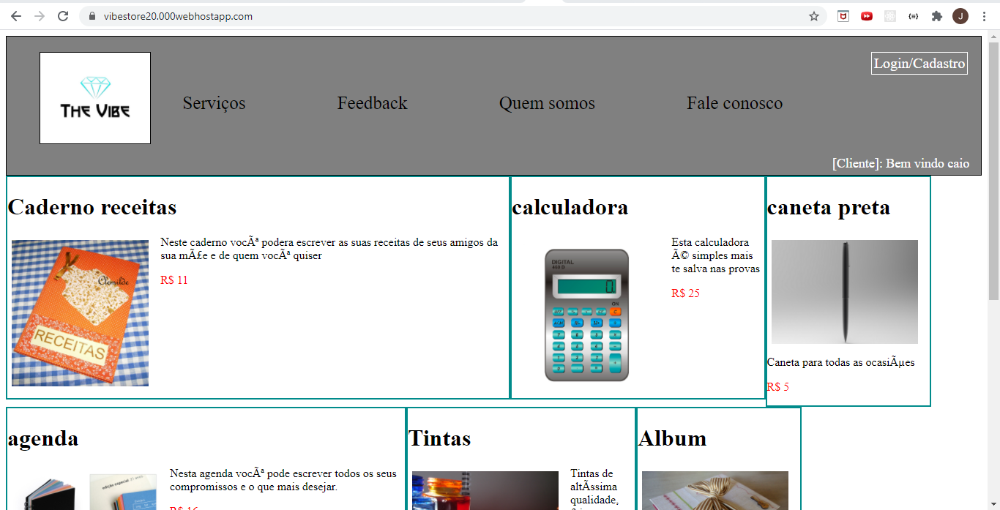

# PROJETO_LABORATÓRIO_DE_PROGRAMAÇÃO
Projeto Web desenvolvido durante a disciplina de Laboratório de Programação. O site criado com a linguagem php possui conexão com banco de dados

### Linguagens utilizadas 
* Php, Javascript
### Para executar o código deve utilizar 
* um servidor php, usamos o 000webhost ( possui suas limitações )
* fazer o upload dos códigos e das imagens
* configurar o banco de dados, e definir o nome do banco, senha e nome do usúario do banco no arquivo de conexão
* abrir o link do site

### Descrição
O projeto tem as seguintes funcionalidades
* o cliente, a empresa terceirizada, o fornecedor e o funcionário pode fazer o login / cadastro no sistema e ficar logado
* é tratado a visualização para cada categória
* algumas funcionalidades: agendar serviços, criar orçamento, cadastrar feedback, listagem dos produtos na tela inicial
* os dados são armazenados em um banco de dados sql phpmyadmin

### Tela principal

### Login

#### Por José Geraldo e João Garcia
